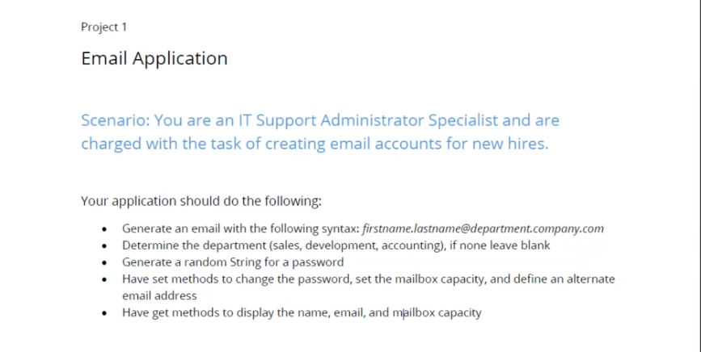

PROJECT REQUIREMENT

Output:
Email of the New Employee Created
bala_gangadhar_reddy.bhuma@sales.gmail.com
Your Password is Created FcEd%5IdAj
Show employee information form a public method available to outside world.
FIRST NAME: bala_gangadhar_reddy
LAST NAME:  bhuma
COMPANY EMAIL: bala_gangadhar_reddy.bhuma@sales.gmail.com
MAILBOX CAPACITY:  Capacity 500

    //Constructor to receive the firstname and lastname
    //Ask for the department - Method
    //Create an email - Method
    //Generate a password - Method

    //Set the mailbox capacity
    //Set the alt departmentChoice
    //SetorChange the password

    //Get Account details - Method
    //Get email
    //Get password

    //Constructor to receive the firstname and lastname
    //Constructor is a public method.
    //createPassword is a private method and accountDetails is a public method. 
